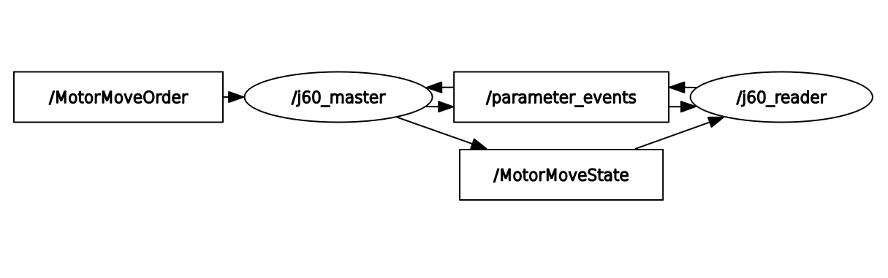

# 🤖 J60 SDK for ROS2
  I wrote this project based on [Deep_Motor_sdk](https://github.com/DeepRoboticsLab/Deep_Motor_SDK) use the J60 motor directly under ROS2.
+ Node Graph

+ How to Use?
  You should pull the source code to your Ubuntu and compile it.
  Once you have compiled it, you can plug in the J60 motor and run the initialization script:
```
  sudo bash ./set_up_can.sh
```
  Then You can use the j60_master node to send control commands.
